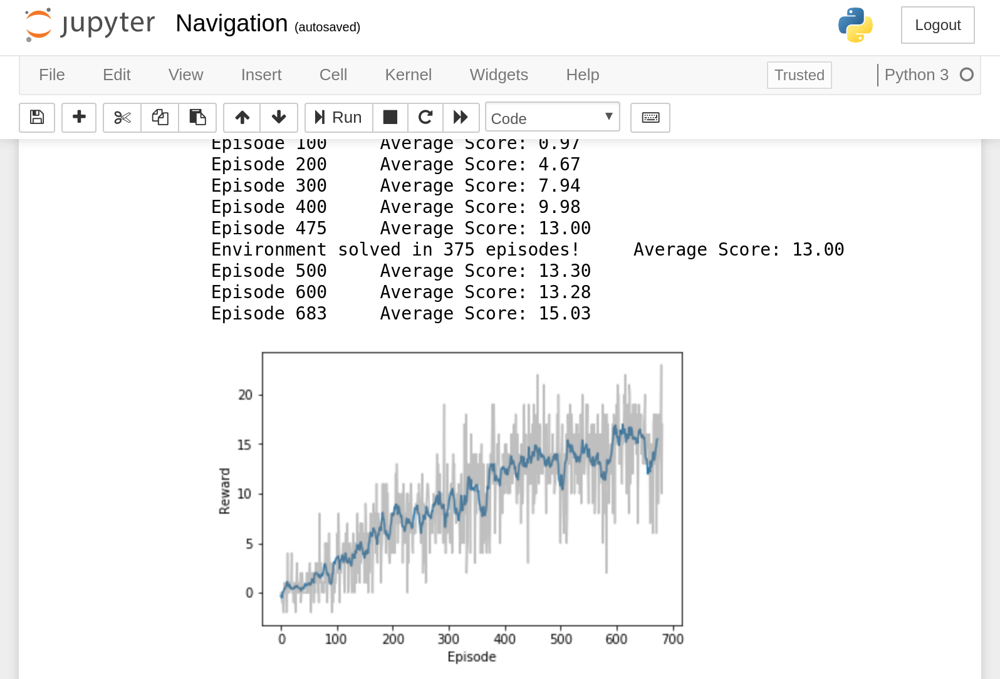
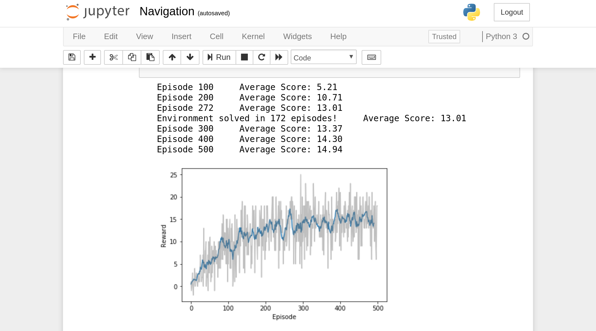
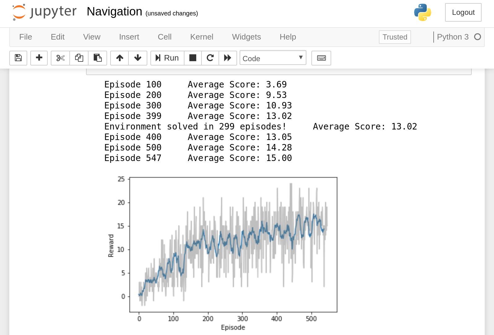
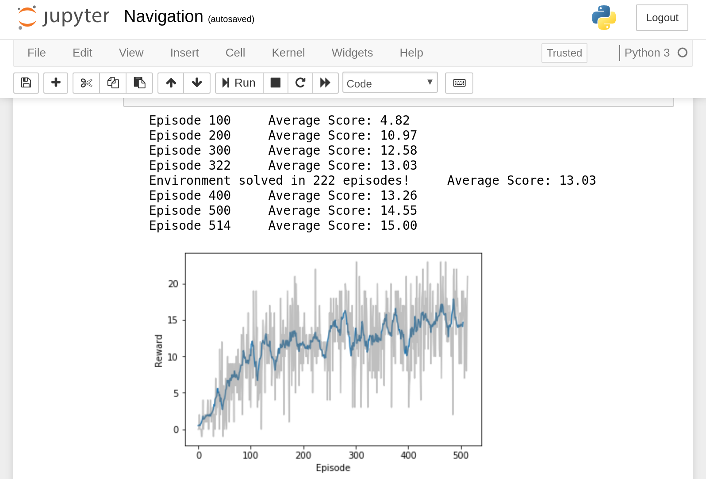
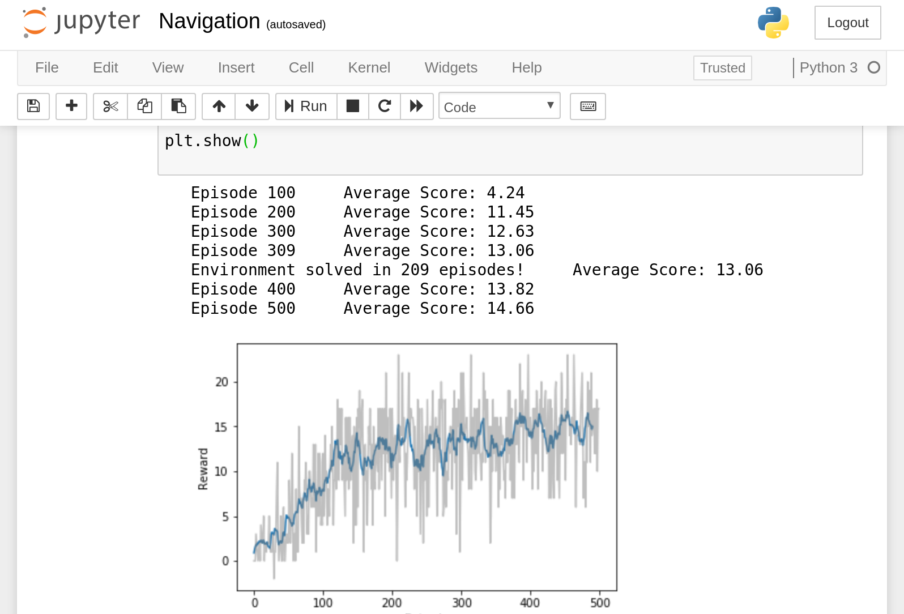
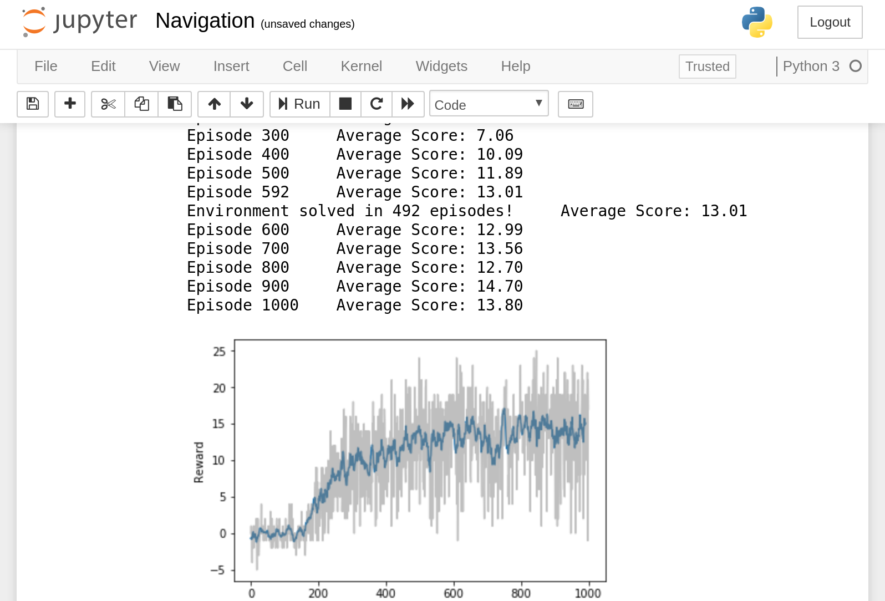

# Navigation project report.

## First steps
I started out with a vanilla Deep Q-Learning Network with two hidden layers comprised of 64 nodes each. 
To follow the examples you have to execute the python notebook [Navigation.ipynb](Navigation.ipynb). The agent is implemented in [dqn_agent.py](dqn_agent.py) which in turn needs [model.py](model.py) to define the network.
At the end of the notebook there is a cell to execute the last agent saved in the checkpoint.pth file.

With the following hyper parameters the 'vanilla' agent learn the task in **375** episodes:
**2 hidden layers of 128 and 256 nodes, batch size= 64, learning rate= 5e-4, discount factor= 0.99, epsilon start= 1.0, epsilon end= 0.01, target updates= 4 steps**.

It is considered that the agent has learned when it gets a +13 reward for 100 episodes.



I let the agent continue its training after solving the task for a total of **500 or 1000** episodes or it reaches an average score of **15** per 100 episodes.

After playing a bit with the hyperparameters, you can get the agent to learn the task in up to **172 episodes** with:
**2 hidden layers of 128 and 256 nodes, batch size= 256, learning rate= 1e-4, discount factor= 0.99, epsilon start= 0.1, epsilon end= 0.0001, target updates= 3 steps**




There are some improvements in the literature to try to overcome the algorithm of deep q-learning. This is Prioritized Experiece Replay, Double Q-Learning and Dueling DQN. All of them have been implemented and will be compared, fixing as hyper parameters the last ones that have given the best results in terms of learning speed (172 episodes).
In the file [dqn_agent.py](dqn_agent.py) you can choose these improvements by modifying the following constants:
```
SIMPLE_DQN= True        # Simple DQN. If not Double DQN
PER = False             # Prioritized Experience Replay
DUELING_DQN= False      # dueling DQN
```

## Prioritized experience replay
DQN with PER. Thanks to https://github.com/rlcode/per for the implemetation of PER. It has been modified to suit my needs.
Default parameters:
```
e = 0.01
a = 0.6
beta = 0.4
beta_increment_per_sampling = 0.001
```



## Double DQN



## Double DQN with Prioritized Experience Replay



## Dueling DQN

Implementado en [model.py](model.py).



## Conclusions
+ No fundamental advantage has been found with DDQN or with PER or Dueling over DQN.
With certain DQN hyperparameters, it turns out to be better in terms of learning speed, reaching **172 episodes at best**.
+ In all cases, learning is very unstable, with the reward graph being very noisy, although there is generally a steady progress up to 13 and then it stabilizes.
+ The agent behaves surprisingly well once it has learned the task although sometimes its movement is a little abrupt. Also sometimes it gets stuck making an oscillating movement without being able to decide which way to go.
+ It's amazing how quickly an agent can learn by itself with deep q-learning in a complex task.

## Improvements
+ To soften the movement of the agent, the reward could be modified depending on whether the lateral movements are very abrupt. In such a case, the reward could be reduced proportionally to lateral movement. The same could also be done in the case of the advance.
