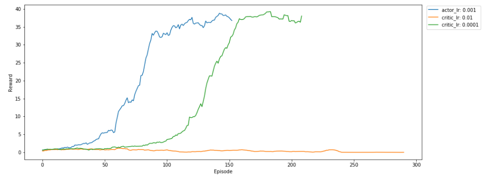

# Reacher project report.
In this paper we are going to do an analysis of the DDPG algorithm in the Reacher environment of [Unity ML-Agents](https://github.com/Unity-Technologies/ml-agents).
To follow this project you can execute the python notebook [Continuous_Control.ipynb](Continuous_Control.ipynb). The agent is implemented in [ddpg.py](ddpg.py) which in turn needs [model.py](model.py) to define the network.
The first cell of the notebook is to set the environment plus some functions to make the code easier.
In the second code cell is where the agent is trained to learn the task acording with a certain hyperparameters.
The third and last cell is to see how the agent behaves once trained.
It is considered that the agent has learned when it gets a +30 reward for 100 episodes.
## First steps
I started out with a Deep Deterministic Policy Gradient (DDPG) agent from [Udacity Deep Learning Nanodegree repository](https://github.com/udacity/deep-reinforcement-learning/tree/master/ddpg-bipedal) for OpenAI Gym's BipedalWalker environment. 
I have reduced the number of fully connected layers from 3 to 2 in the definition of the critic to reduce complexity and gain a bit in process speed. 
The following hyper parameters are the starting point:
```
config= {
    "actor_lr": 0.001,
    "critic_lr": 0.001,
    "actor_nodes": [256, 256],
    "critic_nodes": [256, 256],
    "batch_size": 128,
    "memory_size": 100000,
    "discount": 0.9,
    "sigma": 0.2, # OUNoise
    "tau": 0.001,
}
```
## Hyperparameters selection
Choosing hyperparameters is not an easy task since the number of possibilities is very high. There is no systematic method and it is one of the biggest challenges of the current DRL. Frequently choosing a suitable parameter can mean the difference between the agent learning or not at all.
However, we can make a comparison of different values of each parameter to try to face the question.
To make it faster, the comparison will be made in the first 300 episodes.

### Number of nodes comparison

### Introducing Batch Normalization

### Diferent types of initialization

### Diferent batch sizes

### Noise: standard deviation (sigma)

### Learning rate
Vamos a introducir los mejores resultados anteriores para comenzar a ver el efecto del learning rate:
```
config= {
    "critic_lr": 0.001,
    "actor_nodes": [256, 256],
    "critic_nodes": [256, 256],
    "batch_size": 512,
    "memory_size": 100000,
    "discount": 0.9,
    "sigma": 0.1, # OUNoise
    "tau": 0.001,
}
```
Actor:

Critic:


So finally let's set hyperparameters:
```
config= {
    "actor_lr": 0.001,
    "critic_lr": 0.001,
    "actor_nodes": [256, 256],
    "critic_nodes": [256, 256],
    "batch_size": 512,
    "memory_size": 100000,
    "discount": 0.9,
    "sigma": 0.1, # OUNoise
    "tau": 0.001,
}
```
Resultado:

<p align="center">
  
</p>
Let's see how this agent behaves:

<p align="center">
  
</p>

with a **final score of 36.4**.

----

Now let's see in we can improve the agent by reducing the nodes:
```config= {
    "actor_lr": 0.001,
    "critic_lr": 0.001,
    "actor_nodes": [32, 32],
    "critic_nodes": [128, 128],
    "batch_size": 256,
    "memory_size": 100000,
    "discount": 0.9,
    "sigma": 0.0, # OUNoise
    "tau": 0.001,
}
```

<p align="center">
  
</p>

## Conclusions
+ Network definitions, initializer and batch normalization have been key elements for the agent to start learning.
+ Revisar sistematicamente lo hyperparametros ayuda a mejorar el aprendizaje del agente aunque no asegura encontrar los valores optimos.
+ El agente es sorprendemente sensible al ruido introducido para randomizar la exploracion de las acciones. Cuanto mas reducimos la desviacion tipica, es decir, noise variance, mas rapidamente aprende el agente.
Llevado a limite, el agente es capaz de aprender completamente la tarea eliminando completamete el ruido exploratorio en la fase de aprendizaje. Es justo lo contrario de lo que uno espera.
Esto podria explicarse porque este entorno no ofrece muchas variaciones de movimientos del objetivo.
Su comportamiento es bastante bueno:

<p align="center">
  
</p>

De alguna forma la red es capaz de aprender todas las posibilidades que ofrece el entorno.
Que pasaria si redujeramos los nodos del actor para ver hasta donde es capaz de seguir aprendiendo.
+ It's amazing how quickly an agent can learn by itself with deep q-learning in a complex task.

## Improvements
+ Several agents running in parallel will surely improve both the learning time and the variability of the experience the agent receive.
+ In that case, there are algorithms like [PPO](https://arxiv.org/pdf/1707.06347.pdf), [A3C](https://arxiv.org/pdf/1602.01783.pdf), and [D4PG](https://openreview.net/pdf?id=SyZipzbCb) that use multiple (non-interacting, parallel) copies of the same agent to distribute the task of gathering experience.
