# Tennis project report.

## 1. Description.

In this paper we are going to do an analysis of the [Deep Deterministic Policy Gradient](https://arxiv.org/abs/1509.02971) algorithm in the Tennis environment of [Unity ML-Agents](https://github.com/Unity-Technologies/ml-agents) with the competition of 2 agents playing tennis.

To follow this project you can execute the python notebook [Tennis.ipynb](Tennis.ipynb). 
The first cell of the notebook is to set the environment plus some functions to make the code easier.
In the second code cell is where the agents are trained to learn the task acording with a certain hyperparameters.
The third and last cell is to see how the agents behave once trained.

The agents (2) are implemented in [Agents.py](Agents.py). This class depends on [ddpg.py](ddpg.py) and  [model.py](model.py). The first one define a single agent following [DDPG algorithm](https://arxiv.org/abs/1509.02971) and the second one define the network chosen for an agent.

[Agents.py](Agents.py) contains the definition of n independent agents who can learn from their own experience or from everyone's experience as well as an implementation of Multi-Agent scheme acording to the paper [Multi Agent Actor Critic for Mixed Cooperative Competitive environments](https://papers.nips.cc/paper/7217-multi-agent-actor-critic-for-mixed-cooperative-competitive-environments.pdf) by [OpenAI](https://openai.com/).

<p align="center">
  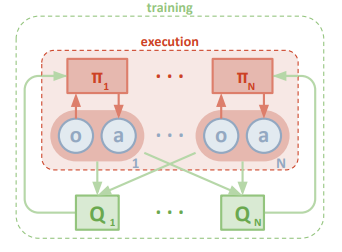
  <br>
  <em><b>Fig. 1: Multi-Agent scheme</b></em>
</p>

We will see several possibilities according to what we enter in the experience replay buffer at the learning phase:
1. Each agent learns from its own experience. Experience replay buffer is feeded with the following tuples:

<p align="center">
  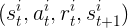
  <br>
</p>

2. Each agent learns from the experience of all agents. Experience replay buffer is feeded with the following tuples:

<p align="center">
  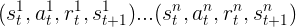
  <br>
</p>


3. Multi-agent. Experience replay buffer is feeded with the following tuples:

        - Self experience:
        
<p align="center">
  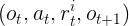
  <br>
</p>

        - All experience:
        
<p align="center">
  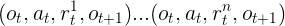
  <br>
</p>

where  o<sub>t</sub>  is the concatenation of all agent's states and  a<sub>t</sub>  is the concatenation of all agents actions.
Thus in multi-agent case, critic state and action sizes are defined:

`critic_state_size= state_size * num_agents`

`critic_action_size= action_size * num_agents`


Regarding the exploratory action noise several possibilities have been implemented in [noise.py](noise.py):

1. Ornstein-Uhlenbeck noise.
2. No noise
3. Normal distribution noise.
4. Parameter noise as suggested in [Better Exploration with Parameter Noise](https://blog.openai.com/better-exploration-with-parameter-noise/). The implementation of [jvmancuso](https://github.com/jvmancuso/ParamNoise/blob/master/utils/noisy.py) has been followed for being very elegant. To do this I substitute all the actor's `Linear` layers by `NoisyLinear` layers defined in [noisy.py](noisy.py).

It is considered that the agents have learned when they get a +0.5 combined reward for 100 episodes.

## 2.- First steps

I started out with the DDPG agent from a [previous project](https://github.com/gregoriomezquita/ml-agents/tree/master/Reacher).

Actor network consists of 3 fully connected layers with Relu activations and a final Tanh non-linear output.
```
Actor(
  (model): Sequential(
    (0): BatchNorm1d(24, eps=1e-05, momentum=0.1, affine=True, track_running_stats=True)
    (1): NoisyLinear (24 -> 32, Factorized: True)
    (2): ReLU()
    (3): BatchNorm1d(32, eps=1e-05, momentum=0.1, affine=True, track_running_stats=True)
    (4): NoisyLinear (32 -> 32, Factorized: True)
    (5): ReLU()
    (6): BatchNorm1d(32, eps=1e-05, momentum=0.1, affine=True, track_running_stats=True)
    (7): NoisyLinear (32 -> 2, Factorized: True)
    (8): Tanh()
  )
)
```
The Critic has also 3 fully connected layers with Relu activations.
```
Critic(
  (model_input): Sequential(
    (0): Linear(in_features=24, out_features=128, bias=True)
    (1): ReLU()
    (2): BatchNorm1d(128, eps=1e-05, momentum=0.1, affine=True, track_running_stats=True)
  )
  (model_output): Sequential(
    (0): Linear(in_features=130, out_features=128, bias=True)
    (1): ReLU()
    (2): Linear(in_features=128, out_features=1, bias=True)
  )
)
```


The following hyperparameters are the starting point:
```
config= {
    "seed": seed,
    "actor_lr": 1e-3,
    "critic_lr": 1e-3,
    "actor_nodes": [32, 32],
    "critic_nodes": [128, 128],
    "batch_size": 256,
    "memory_size": 100000,
    "discount": 0.9,
    "tau": 1e-3,
    "critic_l2_reg": 0.0,  # 1e-2
    "action_noise": "OU",    # Options: No, Normal, OU, Param
    "sigma": 0.1,            # OUNoise, Normal
    "experience": "self",     # Options: self, all
    "multi-agent": False,
}
```

## 3.- Hyperparameters selection


First we will start modifying the exploratory noise to know if it has as good result as in the [starting project](https://github.com/gregoriomezquita/ml-agents/tree/master/Reacher/Report.md).

It is important to point out that in order to compare the results it is necessary to reset the kernel of the notebook otherwise the seed of the environment is not the same.

<p align="center">
  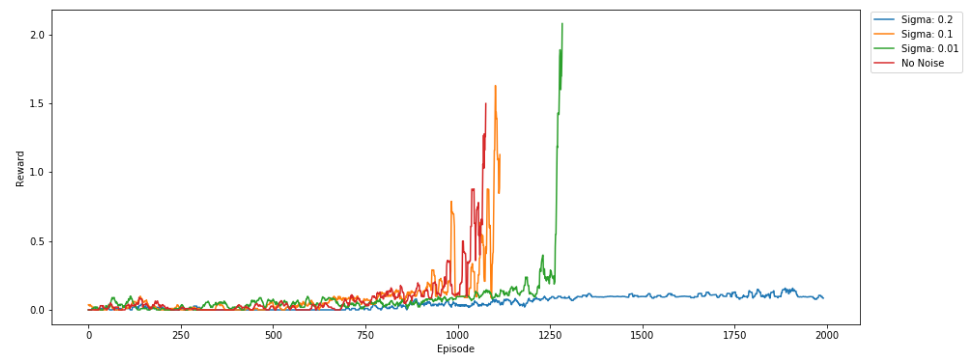
  <br>
  <em><b>Fig. 2: Self-experience Ornstein-Uhlenbeck noise comparation</b></em>
</p>


We can verify that the same result is produced as before: the agents learn faster without exploratory action noise (Ornstein-Uhlenbeck noise).
We also see that actor and critic's model definitions are valid in this case.
And finally, we see that agents are able to learn to compete only with their own experience.

What happens if we combine the experience of all the agents in such a way that each agent also learns from the experience of the others?

<p align="center">
  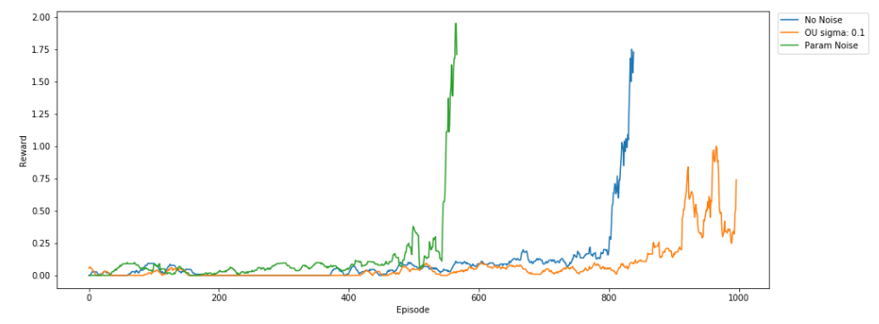
  <br>
  <em><b>Fig. 3: All-experience noise comparison</b></em>
</p>


Playing with other hyperparameters result in:

<p align="center">
  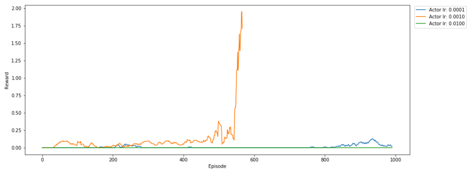
  <br>
  <em><b>Fig. 4: Diferent Actor learning rates</b></em>
</p>

<p align="center">
  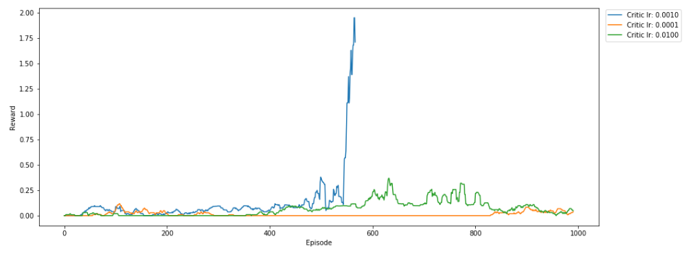
  <br>
  <em><b>Fig. 5: Diferent Critic learning rates</b></em>
</p>

<p align="center">
  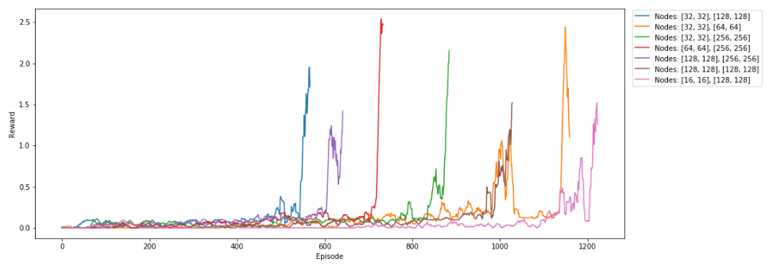
  <br>
  <em><b>Fig. 6: Diferent Actor-Critic node size</b></em>
</p>


According to all the above, the best configuration in terms of learning speed is:
```
config= {
    "seed": seed,
    "actor_lr": 1e-3,
    "critic_lr": 1e-3,
    "actor_nodes": [32, 32],
    "critic_nodes": [128, 128],
    "batch_size": 256,
    "memory_size": 100000,
    "discount": 0.9,
    "tau": 1e-3,
    "critic_l2_reg": 0.0,  
    "action_noise": "Param",    # Options: No, Normal, OU, Param
    "sigma": 0.1,               # OUNoise, Normal
    "experience": "all",        # Options: self, all
    "multi-agent": False,
}
```

<p align="center">
  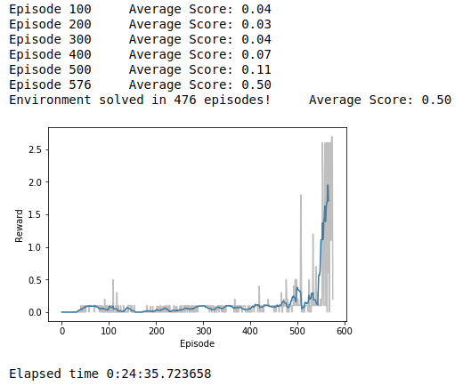
  <br>
  <em><b>Fig. 7: First results</b></em>
</p>

resulting in agents learning in **476 episodes**.

In general, training is very unstable, having pronounced peaks and then falling to almost zero. It is necessary to store the actor's parameters that get a better score instead of the last ones that can be very bad. In the following graph we can see an example of how the score behaves during the learning phase:

<p align="center">
  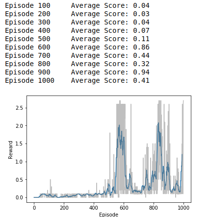
  <br>
  <em><b>Fig. 8: Learning example</b></em>
</p>

Normally, we search for the best set of hyper parameters that gives us a better result in terms of learning speed. However, this criterion does not always lead to a better performance of the players. To compare results it is necessary that the agents, once they have learned, play 100 games and see what their running average is.

The following is a table that includes the average score in 100 games in the last column, including the multi-agent scheme:

| Noise | Experience | Multi-agent | Nodes | Solved in | Running avg. score |
| :---: | :---: | :---: | :---: | ---: | ---: |
| Param | all | no | [32, 32], [128, 128] | 476 | 1.3 |
| Param | all | no | [32, 32], [256, 256] | 794 | 2.1 |
| Param | all | no | [64, 32], [256, 128] | 1323 | 1.2 |
| Param | all | no | [32, 16], [256, 128] | 1761 | 0.6 |
| Param | all | yes | [32, 32], [256, 256] | 1878 | 1.4 |
| OU | self | yes | [32, 32], [128, 128] | 2000+ | 0.4 |
| OU | self | yes | [32, 32], [256, 256] | 2000+ | 0.1 |
| OU | self | yes | [64, 64], [256, 256] | 1599 | 2.0 |
| OU | self | yes | [128, 64], [256, 256] | 2000+ | 0.2 |
| OU | self | yes | [32, 32], [64, 64] | 2149 | 1.6 |
| No | self | yes | [64, 64], [256, 256] | 1497 | 0.5 |
| No | self | yes | [64, 64], [512, 512] | 2000+ | 0.1 |
| No | self | yes | [128, 128], [512, 512] | 3000+ | 0.3 |
| No | all | yes | [64, 64], [256, 256] | 2002 | 0.1 |
| No | all | yes | [32, 32], [256, 256] | 1479 | 0.9 |
| Normal | self | yes | [64, 64], [256, 256] | 1468 | 0.6 |
| Normal | self | yes | [64, 64], [512, 512] | 2000+ | 0.2 |
| Normal | self | yes | [64, 32], [256, 128] | 1221 | 1.6 |
| Normal | all | yes | [64, 32], [256, 128] | 2000+ | 0.1 |


## 4.- Solution

Taking into account all of the above, the best set of hyperparameters is the following:

```
config= {
    "seed": seed,
    "actor_lr": 1e-3,
    "critic_lr": 1e-3,
    "actor_nodes": [32, 32],
    "critic_nodes": [256, 256],
    "batch_size": 256,
    "memory_size": 100000,
    "discount": 0.9,
    "tau": 1e-3,
    "critic_l2_reg": 0.0,  # 1e-2
    "action_noise": "Param",    # Options: No, Normal, OU, Param
    "sigma": 0.1,            # OUNoise, Normal
    "experience": "all",     # Options: self, all
    "multi-agent": False,
}
```
This is a configuration that is **not multi-agent** but has an **average running score of 2.1**. He is also able to learn in only **794 episodes**. 

An example of the players playing:

<p align="center">
    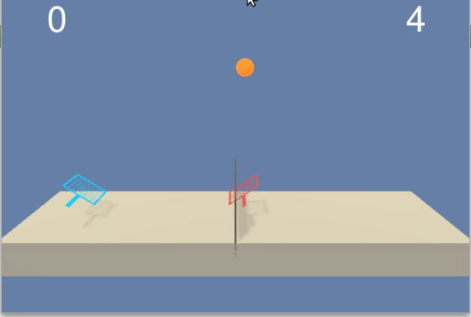
    <br>
    <em><b>Fig. 9: Solution behaviour</b></em>
</p>


## 5.- Conclusions
1. Parameter action noise can work better than other types of noise.
2. Due to the symmetrical nature of tennis players they can learn without the need for a multi-agent scheme.
3. Resolution criteria. It's better to select agents that behave well in task execution rather than in the speed of learning.
## 6.- Improvements
1. Test other types of exploratory action noise.
2. Modify tau and discount factor to see the consequences.
3. Test environments with players with different roles.
